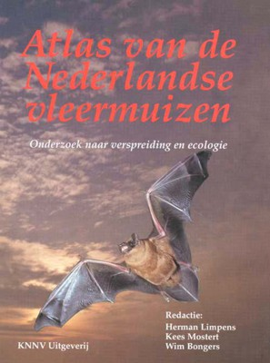
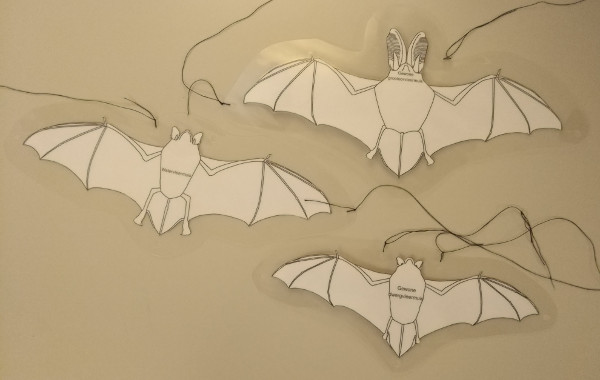

Hillie Waning Vos<!-- spell-check: ignore -->
posted a [message](https://www.facebook.com/groups/136313196423367/permalink/1646676385387033/) in the Facebook group["vleermuizen"]{lang=nl-BE} showing how she created some bat silhouettes at 1:1 scale.
This is useful to illustrate the true size of bats to the public.
She took a simple template and re-sized it to match the wingspan of the different species.
Several people liked the idea.
Some asked for the template or suggested to use a more anatomically correct template.
E.g. a long eared bat should have long ears, a noctule should have narrow wings while a serotine should have broad wings.

<!-- spell-check: ignore -->

I recalled that @Limpens1997 has nice drawings of several bat species.
The drawings, made by [
Peter Twisk<!-- spell-check: ignore -->
](https://petertwisk.nl/), display a bat seen from the ventral side with the left wing full extended and the right wing folded.
Peter was kind enough to give his permission to use his drawings as a template for the silhouettes and share the result. 

I ended up scanning and vectorising the left side of the bat.
Since the drawings were quite detailed, I decided to not only digitise the outline but also the main anatomical features like the contours of the body, ears, mouth, arms, fingers, legs and tail.
Once vectorised, the left side was mirrored in order to get a complete bat with fully extended wings.
Then the image was scaled so that the wingspan matches the average wingspan mentioned in @Limpens1997.

Finally, it is time for some craft work.
Download the pdf with the silhouette (in [Dutch](silhouet-nl.pdf) or in [English](silhouet-en.pdf)) and print the one you like at the correct format.
This is indicated in the lower left corner of the page.
Take a pair of scissors and carefully cut out the silhouette.
I laminated the silhouettes to make them more durable.
Trimming the laminated foil up to 2 cm from the end of the silhouette makes them more compact.
A hole punch is a great tool to make nice round holes in the laminated foil.
You can thread some wire through these holes to hang the bats.

## Downloads

- silhouettes in [Dutch](silhouet-nl.pdf)
- silhouettes in [English](silhouet-en.pdf)
