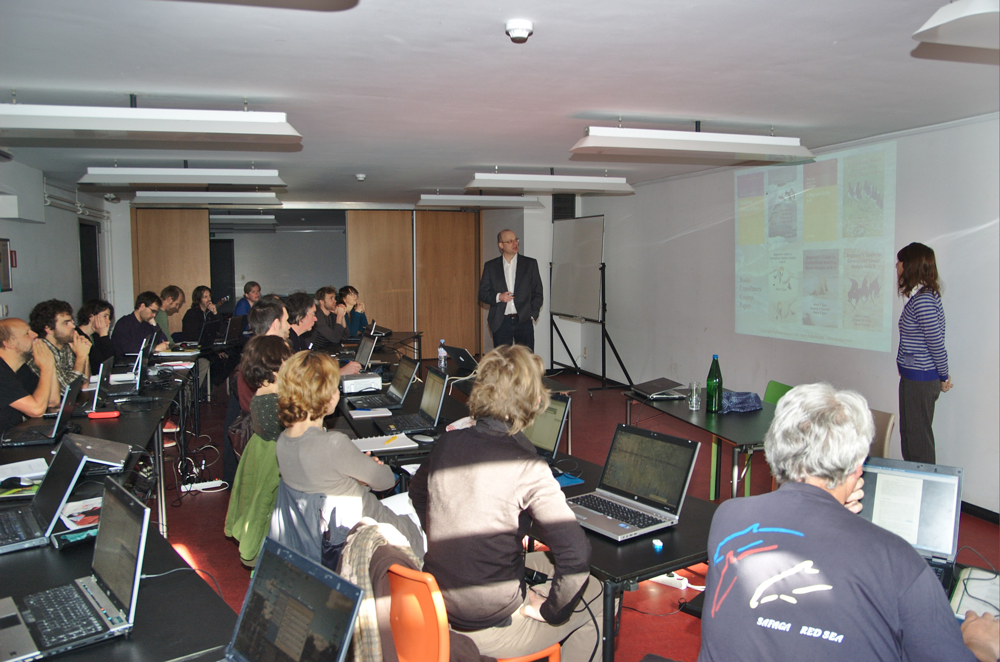
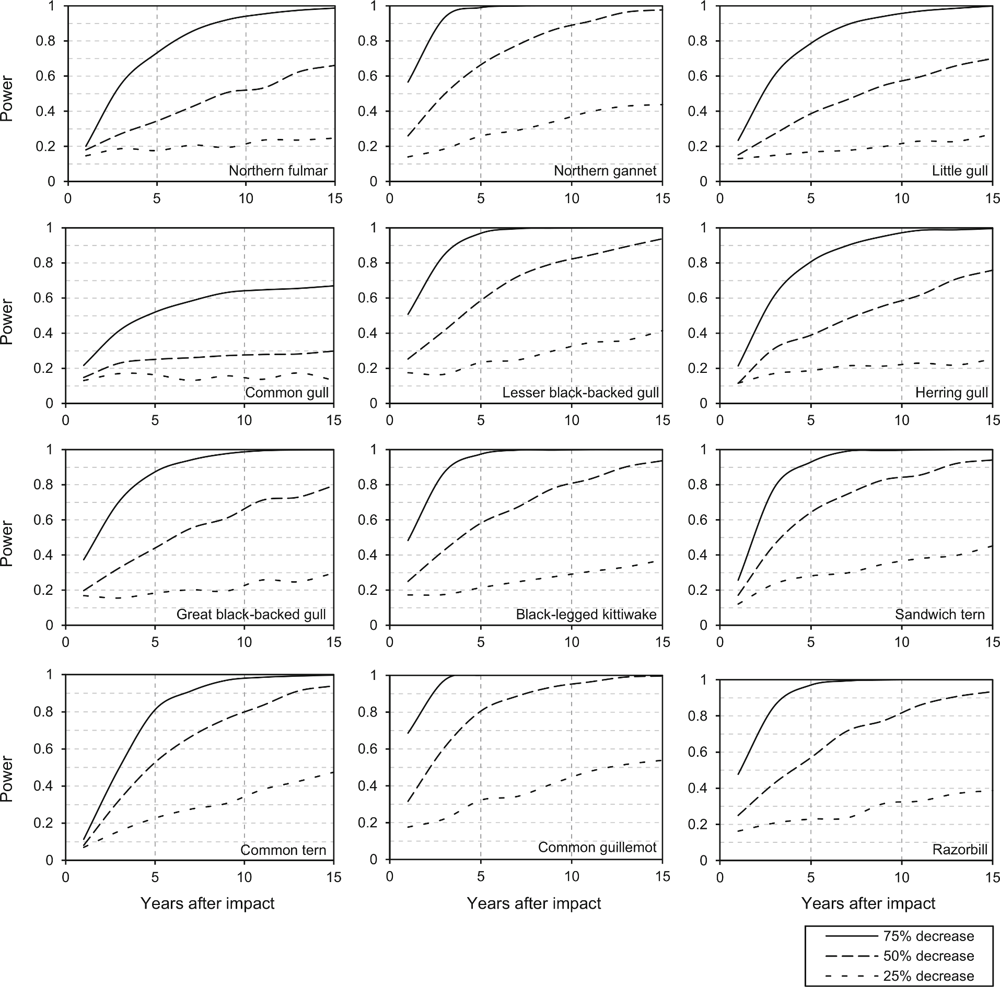
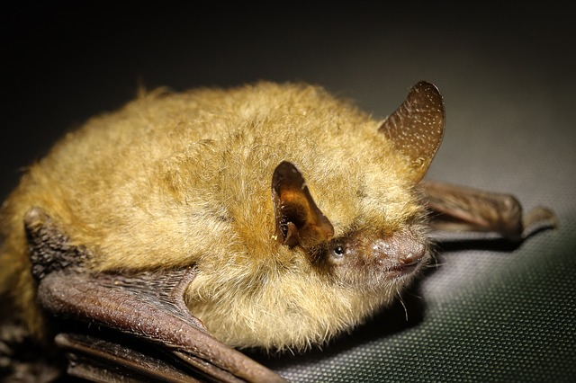
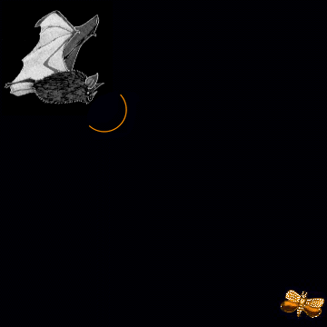
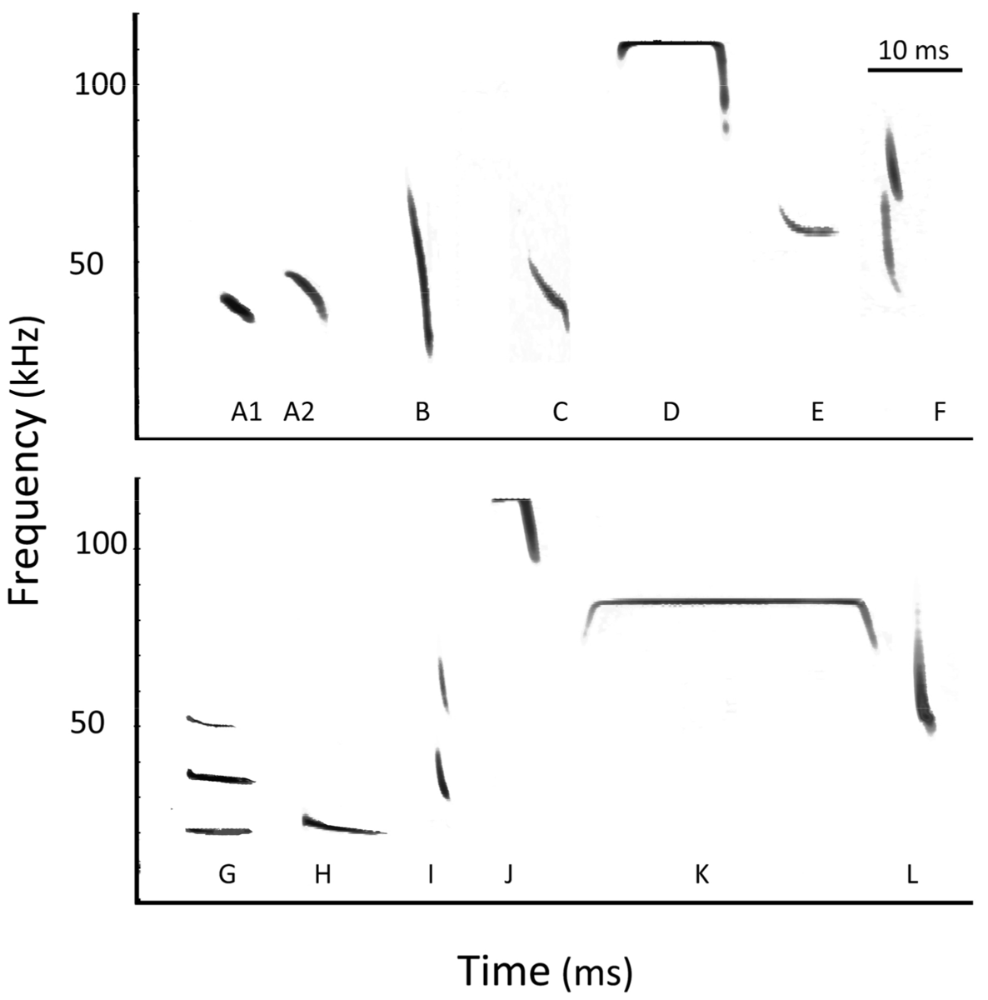
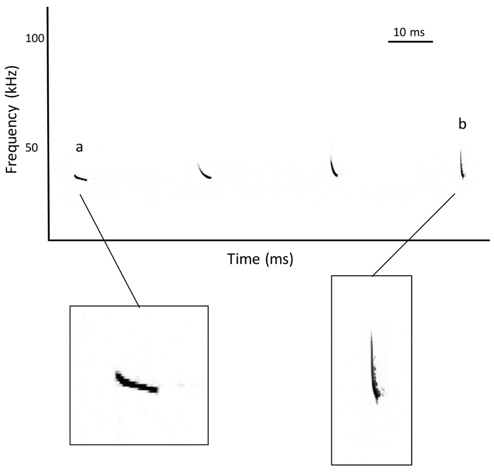
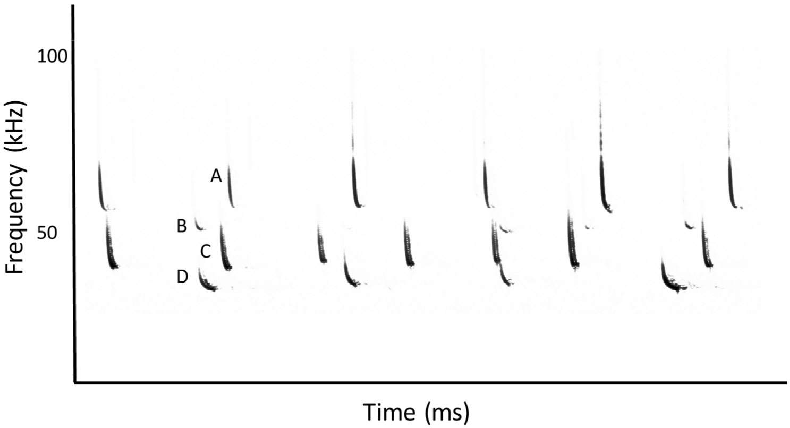
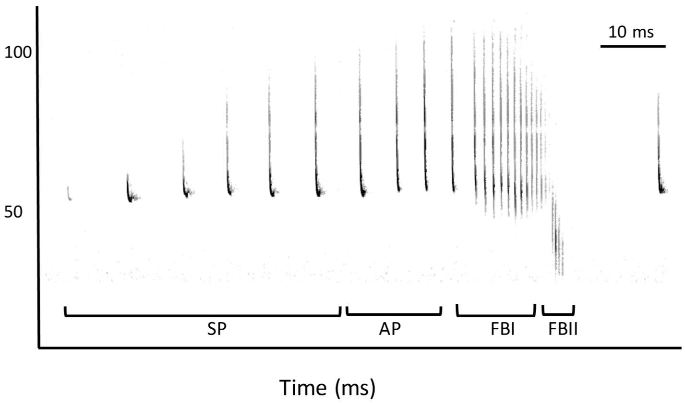

```{r setup, include = FALSE}
library(knitr)
opts_chunk$set(
  echo = FALSE,
  warning = FALSE,
  cache = TRUE,
  autodep = TRUE
)
library(rhinolophus)
library(raster)
library(dplyr)
library(ggplot2)
library(INBOtheme)
library(plotly)
library(wordcloud)
library(lme4)
```

# Introduction

## Talk outline

- intro
- INBO
- BMK
- bats & classification problem

## Goals of the talk

- main goal: feedback on classification of bat calls
- introducing INBO and BMK
- looking for potential collaboration

## Thierry Onkelinx

- degrees [](https://orcid.org/0000-0001-8804-4216)
    - MSc forestry
    - MSc statistical data analysis
- interests
    - design and analysis of long-term monitoring
    - mixed models
    - reproducible and traceable research
    - spatial data
    - bats
    - blog: https://www.muscardinus.be/
    - https://github.com/ThierryO

# INBO

---

```{r}
include_url("https://player.vimeo.com/video/42329947")
```

## Staff

```{r staff}
staff <- 265
admin <- 6 + 13 + 2
management <- 8
wo <- c(BMK = 8, Data = 6, ICT = 5, Lifewatch = 6, Lab = 10, Bib = 8)
science <- staff - admin - sum(wo) - management
```

- `r staff` staff
    - `r science` scientific staff (scientists + technicians)
    - `r sum(wo)` support for scientific staff
    - `r admin` administrative staff
    - `r management` management
- 6 specialised teams dedicated to support the scientific staff
    1. Biometry, Methodology & Quality assurance (`r wo["BMK"]`)
    1. Data-management (`r wo["Data"]`)
    1. Life-watch (`r wo["Lifewatch"]`)
    1. IT operations & development  (`r wo["ICT"]`)
    1. Laboratory  (`r wo["Lab"]`)
    1. Library  (`r wo["Bib"]`)

# Biometry, Methodology & Quality assurance

## Methodological support

### Sir Ronald Aylmer Fisher

To call in the statistician after the experiment is done may be no more than asking him to perform a post-mortem examination: he may be able to say what the experiment died of.

## Partner during research

```{r paper}
dataset <- frame_data(
  ~Title, ~X, ~Y, ~Hjust, ~Vjust, ~Step, ~Bullets,
  "Knowledge", 0, 1.5, 0.5, 0.5, -1, "",
  "Data", 0, -1.5, 0.5, 0.5, -1, "",
  "Design", 1.5, 0, 0.5, 0.5, -1, "",
  "Inference", -1.5, 0, 0.5, 0.5, -1, "",
  "Discussion", -1.2, 1.2, 0, 1, 4,
"- Interpretation of results
- Scope of the model
- Validity of research
- Policy recommendations
- Policy tools",
  "Introduction", 0.2, 1.2,  0, 1, 1,
"- Concept
- Hypothesis
- Motivation",
  "Materials & Methods", 0.2, -0.1,  0, 1, 2,
"- Design
- Sampling
- Sample size
- Field protocol
- Statistical analysis",
  "Results", -1.2, -0.1,  0, 1, 3,
"- Good statistical practices
- Technical support
- Statistical interpretation"
) 
dataset %>%
  mutate(
    Bullets = ifelse(Step <= -1, Bullets, ""),
    Title = ifelse(Step == -1, NA, Title)
  ) %>%
  ggplot(aes(x = X, y = Y)) +
  geom_text(
    aes(label = Bullets, y = Y - 0.3), 
    hjust = 0, vjust = 1, size = 4, colour = inbo.hoofd
  ) +
  geom_label(
    aes(label = Title, hjust = Hjust, vjust = Vjust, colour = Step == -1), 
    size = 5, 
    show.legend = FALSE
  ) +
  theme_void() +
  scale_x_continuous(expand = c(0.1, 0)) +
  ylim(-1.5, 1.5)
```

## Partner during research

```{r paper0}
dataset %>%
  mutate(Bullets = ifelse(Step <= 0, Bullets, "")) %>%
  ggplot(aes(x = X, y = Y)) +
  geom_vline(xintercept = 0, linetype = 2) +
  geom_hline(yintercept = 0, linetype = 2) +
  geom_text(
    aes(label = Bullets, y = Y - 0.3), 
    hjust = 0, vjust = 1, size = 4, colour = inbo.hoofd
  ) +
  geom_label(
    aes(label = Title, hjust = Hjust, vjust = Vjust, colour = Step == -1), 
    size = 5, 
    show.legend = FALSE
  ) +
  theme_void() +
  scale_x_continuous(expand = c(0.1, 0)) +
  ylim(-1.5, 1.5)
```

## Partner during research

```{r paper1}
dataset %>%
  mutate(Bullets = ifelse(Step <= 1, Bullets, "")) %>%
  ggplot(aes(x = X, y = Y)) +
  geom_vline(xintercept = 0, linetype = 2) +
  geom_hline(yintercept = 0, linetype = 2) +
  geom_text(
    aes(label = Bullets, y = Y - 0.3), 
    hjust = 0, vjust = 1, size = 4, colour = inbo.hoofd
  ) +
  geom_label(
    aes(label = Title, hjust = Hjust, vjust = Vjust, colour = Step == -1), 
    size = 5, 
    show.legend = FALSE
  ) +
  theme_void() +
  scale_x_continuous(expand = c(0.1, 0)) +
  ylim(-1.5, 1.5)
```

## Partner during research

```{r paper2}
dataset %>%
  mutate(Bullets = ifelse(Step <= 2, Bullets, "")) %>%
  ggplot(aes(x = X, y = Y)) +
  geom_vline(xintercept = 0, linetype = 2) +
  geom_hline(yintercept = 0, linetype = 2) +
  geom_text(
    aes(label = Bullets, y = Y - 0.3), 
    hjust = 0, vjust = 1, size = 4, colour = inbo.hoofd
  ) +
  geom_label(
    aes(label = Title, hjust = Hjust, vjust = Vjust, colour = Step == -1), 
    size = 5, 
    show.legend = FALSE
  ) +
  theme_void() +
  scale_x_continuous(expand = c(0.1, 0)) +
  ylim(-1.5, 1.5)
```

## Partner during research

```{r paper3}
dataset %>%
  mutate(Bullets = ifelse(Step <= 3, Bullets, "")) %>%
  ggplot(aes(x = X, y = Y)) +
  geom_vline(xintercept = 0, linetype = 2) +
  geom_hline(yintercept = 0, linetype = 2) +
  geom_text(
    aes(label = Bullets, y = Y - 0.3), 
    hjust = 0, vjust = 1, size = 4, colour = inbo.hoofd
  ) +
  geom_label(
    aes(label = Title, hjust = Hjust, vjust = Vjust, colour = Step == -1), 
    size = 5, 
    show.legend = FALSE
  ) +
  theme_void() +
  scale_x_continuous(expand = c(0.1, 0)) +
  ylim(-1.5, 1.5)
```

## Partner during research

```{r paper4}
dataset %>%
  ggplot(aes(x = X, y = Y)) +
  geom_vline(xintercept = 0, linetype = 2) +
  geom_hline(yintercept = 0, linetype = 2) +
  geom_text(
    aes(label = Bullets, y = Y - 0.3), 
    hjust = 0, vjust = 1, size = 4, colour = inbo.hoofd
  ) +
  geom_label(
    aes(label = Title, hjust = Hjust, vjust = Vjust, colour = Step == -1), 
    size = 5, 
    show.legend = FALSE
  ) +
  theme_void() +
  scale_x_continuous(expand = c(0.1, 0)) +
  ylim(-1.5, 1.5)
```

## Acquisition, development and maintainance of methodologies

> - Concept for setting up long term ecological monitoring
> - Field protocols
> - Novel statistical techniques
> - Automation of recurring analyses
> - Traceability of analyses

## Statistical support

### Karl Pearson

The unity of all science consists alone in its method, not in its material.

## Tools open and reproducible analysis

> - R
> - Scripted analysis
> - Version control
> - Dynamic documents
> - Corporate identity styles for graphics and dynamic documents

## Freeware open source software

```{r wordcloud}
set.seed(123)
cloud <- frame_data(
  ~words, ~freq,
  "R", 50,
  "RStudio", 25,
  "Markdown", 25,
  "GitHub", 25,
  "ggplot2", 10,
  "dplyr", 10,
  "tidyr", 10,
  "DBI", 3,
  "sp", 3,
  "rgeos", 3,
  "rgdal", 3,
  "INBOmd", 5,
  "INBOtheme", 5,
  "multimput", 5,
  "devtools", 5,
  "INLA", 5,
  "lme4", 5,
  "vegan", 5,
  "ggmap", 3,
  "leaflet", 3,
  "googlesheets", 3,
  "gstat", 3,
  "nlme", 5, 
  "lintr", 3,
  "covr", 3,
  "lubridate", 3,
  "mgcv", 5,
  "multcomp", 3,
  "knitr", 5,
  "raster", 3,
  "readr", 5,
  "readxl", 5,
  "testthat", 3
)
wordcloud(
  words = cloud$words,
  freq = cloud$freq,
  random.color = TRUE,
  colors = inbo.2015.colours(9)
)
```

---



## Statistical expertise

### George E. P. Box

All models are wrong, but some are useful.

## Data validation

```{r tree}
dataset <- read.csv("tree.csv") %>%
  mutate(lc130 = log(c130 / 100))
model <- lmer(
  height ~ poly(lc130, 2) + (poly(lc130, 2) | location),
  data = dataset
)
dataset <- dataset %>%
  mutate(
    fit = fitted(model),
    residual = residuals(model),
    rank = n() - min_rank(abs(residual))
  )
max_rank <- 27
relevant <- dataset %>%
  filter(rank <= max_rank) %>%
  distinct(location) 
dataset %>%
  semi_join(relevant, by = "location") %>%
  mutate(
    anomaly = rank <= max_rank
  ) %>%
  arrange(desc(rank)) %>%
  ggplot(aes(x = c130, y = height)) +
  geom_jitter(
    aes(colour = anomaly), 
    position = position_jitter(width = 5, height = 0)
  ) +
  geom_line(aes(y = fit)) +
  facet_wrap(~location) +
  xlab("Circumference at 130 cm (cm)") +
  ylab("Tree height (m)") +
  scale_colour_manual(
    "Anomaly", 
    values = c("FALSE" = inbo.steun.geelgroen, "TRUE" = inbo.hoofd)
  )
```

## Power calculation




# Designing long-term ecological monitoring

## The 'good' old days

```{r oldschool, fig.height = 2}
theme_set(theme_inbo(6, transparent = TRUE))
z <- 0.6
texts <- data.frame(
  phase = 0:5,
  label = c(
"vague
information
requirements", 
"Phase I
supply and demand", 
"Phase II
design
data collection",  
"Phase III
design
data management
data analysis", 
"Phase IV
design
reporting
communication", 
"Phase V
implementation"
    ),
  x = c(-1.5, -z, 0,  z,  0, 1.5),
  y = c(   0,  0, z,  0, -z, 0)
)
shapes <- bind_rows(
  expand.grid(
    phase = 1:4,
    x = 0,
    y = 0
  ),
  expand.grid(
    phase = 1:4,
    angle = seq(-0.5, 0.5, length = 41) * pi / 3 + pi
  ) %>%
  mutate(
    angle = angle - (phase - 1) * pi / 2,
    x = cos(angle),
    y = sin(angle)
  ),
  expand.grid(
    phase = 1:4,
    x = 0,
    y = 0
  ),
  data.frame(
    phase = 0,
    x = c(-1.2, -1.2, -1.8, -1.8, -1.2),
    y = c(-0.3, 0.3, 0.3, -0.3, -0.3)
  ),
  data.frame(
    phase = 5,
    x = c(1.2, 1.2, 1.8, 1.8, 1.2),
    y = c(-0.3, 0.3, 0.3, -0.3, -0.3)
  )
)
rad <- 0.8
arrows <- data.frame(
  phase = 1:4
) %>%
  mutate(
    start = 0.5 * pi / 3 + (phase - 1) * pi / 2,
    end = -0.5 * pi / 3 + phase * pi / 2,
    x = cos(start) * rad,
    y = sin(start) * rad,
    xend = cos(end) * rad,
    yend = sin(end) * rad
  )
triple_arrows <- expand.grid(
  extra = c(-1, 0, 1)
) %>%
  mutate(
    x = -1.2,
    xend = 1.2,
    y = extra * 0.1,
    yend = extra * 0.1
  )
shapes %>%
  filter(phase %in% c(0, 5)) %>%
  ggplot(aes(x = x, y = y)) +
  geom_path(aes(group = phase)) +
  geom_segment(
    data = triple_arrows, 
    aes(xend = xend, yend = yend), 
    arrow = arrow(length = unit(2, "mm"), type = "closed")
  ) +
  geom_text(
    data = filter(texts, phase %in% c(0, 5)), 
    aes(label = gsub("Phase V\n", "", label))
  ) +
  coord_fixed() + 
  theme_void()
```

### John Tukey

The combination of some data and an aching desire for an answer does not ensure that a reasonable answer can be extracted from a given body of data.

## 5 stages of preparing LTEM

```{r guidebook}
triple_arrows <- expand.grid(
  place = c(-1, 1),
  extra = c(-1, 0, 1)
) %>%
  mutate(
    x = pmin(place, place * 1.2),
    xend = pmax(place, place * 1.2),
    y = extra * 0.1,
    yend = extra * 0.1
  )
ggplot(shapes, aes(x = x, y = y)) +
  geom_path(aes(group = phase)) +
  geom_segment(
    data = triple_arrows, 
    aes(xend = xend, yend = yend), 
    arrow = arrow(length = unit(2, "mm"), type = "closed")
  ) +
  geom_segment(
    data = arrows, 
    aes(xend = xend, yend = yend), 
    arrow = arrow(ends = "both", length = unit(2, "mm"))
  ) +
  geom_text(data = texts, aes(label = label)) +
  coord_fixed() + 
  theme_void()
```

## Focus on the relevant questions

```{r guidebook0}
shapes %>%
  mutate(background = phase == 0) %>%
  ggplot(aes(x = x, y = y)) +
  geom_polygon(aes(group = phase, fill = background ), show.legend = FALSE) +
  geom_segment(
    data = triple_arrows, 
    aes(xend = xend, yend = yend), 
    arrow = arrow(length = unit(2, "mm"), type = "closed")
  ) +
  geom_segment(
    data = arrows, 
    aes(xend = xend, yend = yend), 
    arrow = arrow(ends = "both", length = unit(2, "mm"))
  ) +
  geom_text(data = texts, aes(label = label)) +
  coord_fixed() + 
  scale_fill_manual(values = c("TRUE" = inbo.steun.geelgroen, "FALSE" = NA)) +
  theme_void()
```

## Prioritise the questions

```{r guidebook1}
shapes %>%
  mutate(background = phase == 1) %>%
  ggplot(aes(x = x, y = y)) +
  geom_polygon(aes(group = phase, fill = background), show.legend = FALSE) +
  geom_segment(
    data = triple_arrows, 
    aes(xend = xend, yend = yend), 
    arrow = arrow(length = unit(2, "mm"), type = "closed")
  ) +
  geom_segment(
    data = arrows, 
    aes(xend = xend, yend = yend), 
    arrow = arrow(ends = "both", length = unit(2, "mm"))
  ) +
  geom_text(data = texts, aes(label = label, colour = phase == 1), show.legend = FALSE) +
  scale_colour_manual(values = c("TRUE" = inbo.bruinrood, "FALSE" = inbo.steun.blauw)) +
  coord_fixed() + 
  scale_fill_manual(values = c("TRUE" = inbo.steun.geelgroen, "FALSE" = NA)) +
  theme_void()
```

## Scenarios: power and cost 

```{r guidebook2}
shapes %>%
  mutate(background = phase == 2) %>%
  ggplot(aes(x = x, y = y)) +
  geom_polygon(aes(group = phase, fill = background), show.legend = FALSE) +
  geom_segment(
    data = triple_arrows, 
    aes(xend = xend, yend = yend), 
    arrow = arrow(length = unit(2, "mm"), type = "closed")
  ) +
  geom_segment(
    data = arrows, 
    aes(xend = xend, yend = yend), 
    arrow = arrow(ends = "both", length = unit(2, "mm"))
  ) +
  geom_text(data = texts, aes(label = label, colour = phase == 2), show.legend = FALSE) +
  scale_colour_manual(values = c("TRUE" = inbo.bruinrood, "FALSE" = inbo.steun.blauw)) +
  coord_fixed() + 
  scale_fill_manual(values = c("TRUE" = inbo.steun.geelgroen, "FALSE" = NA)) +
  theme_void()
```

## From raw data to final results

```{r guidebook3}
shapes %>%
  mutate(background = phase == 3) %>%
  ggplot(aes(x = x, y = y)) +
  geom_polygon(aes(group = phase, fill = background), show.legend = FALSE) +
  geom_segment(
    data = triple_arrows, 
    aes(xend = xend, yend = yend), 
    arrow = arrow(length = unit(2, "mm"), type = "closed")
  ) +
  geom_segment(
    data = arrows, 
    aes(xend = xend, yend = yend), 
    arrow = arrow(ends = "both", length = unit(2, "mm"))
  ) +
  geom_text(data = texts, aes(label = label, colour = phase == 3), show.legend = FALSE) +
  scale_colour_manual(values = c("TRUE" = inbo.bruinrood, "FALSE" = inbo.steun.blauw)) +
  coord_fixed() + 
  scale_fill_manual(values = c("TRUE" = inbo.steun.geelgroen, "FALSE" = NA)) +
  theme_void()
```

## What to communicate

```{r guidebook4}
shapes %>%
  mutate(background = phase == 4) %>%
  ggplot(aes(x = x, y = y)) +
  geom_polygon(aes(group = phase, fill = background), show.legend = FALSE) +
  geom_segment(
    data = triple_arrows, 
    aes(xend = xend, yend = yend), 
    arrow = arrow(length = unit(2, "mm"), type = "closed")
  ) +
  geom_segment(
    data = arrows, 
    aes(xend = xend, yend = yend), 
    arrow = arrow(ends = "both", length = unit(2, "mm"))
  ) +
  geom_text(data = texts, aes(label = label, colour = phase == 4), show.legend = FALSE) +
  scale_colour_manual(values = c("TRUE" = inbo.bruinrood, "FALSE" = inbo.steun.blauw)) +
  coord_fixed() + 
  scale_fill_manual(values = c("TRUE" = inbo.steun.geelgroen, "FALSE" = NA)) +
  theme_void()
```

## We're almost ready

```{r guidebook6}
shapes %>%
  mutate(background = phase == 5) %>%
  ggplot(aes(x = x, y = y)) +
  geom_polygon(aes(group = phase, fill = background), show.legend = FALSE) +
  geom_segment(
    data = triple_arrows, 
    aes(xend = xend, yend = yend), 
    arrow = arrow(length = unit(2, "mm"), type = "closed")
  ) +
  geom_segment(
    data = arrows, 
    aes(xend = xend, yend = yend), 
    arrow = arrow(ends = "both", length = unit(2, "mm"))
  ) +
  geom_text(data = texts, aes(label = label, colour = phase == 5), show.legend = FALSE) +
  scale_colour_manual(values = c("TRUE" = inbo.bruinrood, "FALSE" = inbo.steun.blauw)) +
  coord_fixed() + 
  scale_fill_manual(values = c("TRUE" = inbo.steun.geelgroen, "FALSE" = NA)) +
  theme_void()
```

# Bats

---


---



## Overview

- 1000+ species (21 in Belgium)
- all species protected by EU and national legislation
    - need to report status and trend to EU
- nocturnal lifestyle
    - hides during the day
    - visual assessment during night not feasible
    - listen to echolocation

---

```{r}

```

---

```{r}
include_url("https://www.youtube-nocookie.com/embed/MgRh_Q_xwys")
```

## Echolocation analysis

- ultrasonic
- record sound with high sampling rate (> 310 kHz)
- convert sound to sonogram
- interpretation of sonogram

---

```{r}

```

---

```{r}
night <- readRDS("night.rds")
ggplot(data = night, aes(x = mtime)) + 
  geom_histogram(binwidth = 5 * 60) +
  geom_density(adjust = 0.5, aes(y = 5 * 60 * ..count..), colour = inbo.hoofd) +
  scale_x_datetime("Time of night") +
  scale_y_continuous("Number of recordings per 5 min") +
  ggtitle("One night at 'kasteel van Beersel'")
```

## Monitoring bats

- $n_d \ge 20$ sites / routes
- $n_n \ge 5$ nights
- $n_r \sim 500$ recordings per night and per site
- $n_s \ge 6$ species
- $n_y \ge 24$ years

A minimal set-up

  - $n_d n_n n_r n_s \ge 300k$ recordings/year
  - $\frac{300k \times 0.1min}{60 min/h \times 8h/d \times 200d/y} = 0.31 FTE$

## Ideal scenario

> - fully automated classification
> - identify species
> - identify behaviour(s)
> - number of individuals per species
> - handle "new" species

## More realistic

> - good balance between precision and recall
> - hierarchical classification
> - semi-supervised classification
> - allow user to train model

# Things get complicated

## Other sources of ultrasound

- crickets
- raindrops
- wind through foliage
- observer
- cars: engine, breaking, indicators, ...

## Bats are not birds 

@Russo2017

> - social communication
> - echolocation

## Habitat structure

```{r}

```

## Phylogenetic dependencies

```{r}

```

## Call type

```{r}

```

---

```{r}
v <- 343
v_r <- seq(0, 20, by = 2)
v_s <- seq(0, 15)
f_s <- c(20, 45, 90)
p <- expand.grid(
  v = v,
  v_r = v_r,
  v_s = v_s,
  f_s = f_s,
  d_s = c(-1, 1),
  d_r = c(-1, 1)
) %>%
  mutate(
    f_c = f_s * (v + d_s * v_s) / (v + d_r * v_r) - f_s,
    direction = ifelse(
      d_s == 1,
      ifelse(d_r == 1, "forward", "opposite"),
      ifelse(d_r == 1, "towards", "backward")
    ) %>%
      factor(),
    f_s = factor(f_s, labels = paste0(unique(f_s), "kHz"))
  ) %>%
  ggplot(aes(x = v_s, y = f_c, colour = f_s, group = direction, frame = v_r)) +
  geom_line() +
  xlab("Speed of the bat (m/s)") + 
  scale_y_continuous("Change in frequency (kHz)", breaks = seq(-10, 10, by = 2)) +
  ggtitle("Doppler shift")
ggplotly(p, dynamicTicks = TRUE)
```

## Atmospheric attenuation

- sounds are absorbed by air
- key factors: distance and frequency
- result: partial calls

## Real sonogram

```{r read_sonogram}
filename <- "mdau-1_nnoc-1_ppip-2µl1µA048_AHP.WAV"
sonogram <- read_wav(
  filename,
  channel = gsub(".*µ(.)([[:digit:]])*µ.*", "\\1", filename),
  te.factor = as.integer(gsub(".*µ(.)([[:digit:]])*µ.*", "\\2", filename))
) %>%
  wav2spectrogram()
sonogram@SpecGram$f <- sonogram@SpecGram$f / 1000
sonogram@SpecGram$t <- sonogram@SpecGram$t * 1000
sonor <- raster(
  sonogram@SpecGram$S[rev(seq_along(sonogram@SpecGram$f)), ],
  xmn = min(sonogram@SpecGram$t),
  xmx = max(sonogram@SpecGram$t),
  ymn = min(sonogram@SpecGram$f),
  ymx = max(sonogram@SpecGram$f)
)
```

```{r sonogram, cache = FALSE}
sonor2 <- sonor
sonor2[sonor2 < 0] <- NA
breaks <- pretty(0:cellStats(sonor2, max), 20)
plot(
  sonor2, 
  breaks = breaks, 
  col = rev(rainbow(length(breaks), end = 0.7)),
  colNA = "black",
  xlim = c(0, 200),
  ylim = c(0, 140),
  xlab = "time (ms)",
  ylab = "frequency (kHz)"
)
```

## Strong dependencies

> - pulses close in time within a recording
> - recordings close in time
> - recordings close in space
> - curse or blessing?


# Things I've tried & idea's

## Drawbacks existing software

> - one size fits all
> - output only at recording level
> - little assistance for validation
> - user can't update model

## Potential workflow

> 1. detect potential pulses
> 1. convert into features
> 1. unsupervised classification
> 1. manually classify sample
> 1. supervised classification
> 1. validation + retrain model

## Extract pulses from sonogram

```{r pulse}
dB <- extent(1618, 1628, 40, 110) %>%
  crop(x = sonor)
dBm <- as.matrix(dB)
dBm <- dBm[, rev(seq_len(ncol(dBm)))]
plot_ly(z = ~dBm, type = "surface")
```

## Convert pulses into numbers

- watershed: ridge or valley detection
- pixels or voxels
- elliptical Fourier on contours
- spherical Fourier on surface

## Elliptical Fourier

```{r elliptical-fourier, message = FALSE, warning = FALSE}
contour <- get_contours(dB, cellStats(dB, max) - 25)[2, ] %>%
  fortify() %>%
  mutate(theta = 2 * pi * order / (n() - 1))
fourier <- lapply(
  1:20,
  function(n){
    form <- sprintf("I(sin(%1$i * theta)) + I(cos(%1$i * theta))", seq_len(n)) %>%
      paste(collapse = "+") %>%
      sprintf(fmt = "cbind(long, lat) ~ %s") %>%
      as.formula()
    model <- lm(form, data = contour)
    fitted(model) %>%
      as.data.frame() %>%
      mutate(component = n)
  }
) %>%
  bind_rows()
p <- ggplot(contour, aes(x = long, y = lat)) +
  geom_polygon(fill = NA, colour = inbo.hoofd) +
  geom_polygon(
    data = fourier, 
    aes(frame = component), 
    fill = NA
  ) +
  coord_fixed() +
  xlab("time (ms)") +
  ylab("frequency (kHz)")
ggplotly(p)
```

## Elliptical Fourier

```{r elliptical-fourier2, message = FALSE, warning = FALSE}
dB2 <- extent(1620, 1650, 45, 90) %>%
  crop(x = sonor)
contour <- get_contours(dB2, cellStats(dB2, max) - 28)[2, ] %>%
  fortify() %>%
  mutate(theta = 2 * pi * order / (n() - 1))
fourier <- lapply(
  1:20,
  function(n){
    form <- sprintf("I(sin(%1$i * theta)) + I(cos(%1$i * theta))", seq_len(n)) %>%
      paste(collapse = "+") %>%
      sprintf(fmt = "cbind(long, lat) ~ %s") %>%
      as.formula()
    model <- lm(form, data = contour)
    fitted(model) %>%
      as.data.frame() %>%
      mutate(component = n)
  }
) %>%
  bind_rows()
p <- ggplot(contour, aes(x = long, y = lat)) +
  geom_polygon(fill = NA, colour = inbo.hoofd) +
  geom_polygon(
    data = fourier, 
    aes(frame = component), 
    fill = NA
  ) +
  coord_fixed() +
  xlab("time (ms)") +
  ylab("frequency (kHz)")
ggplotly(p)
```

## Unsupervised classification

> - self organizing maps (SOM) [@kohonen1982]
> - adaptive resonance theory (ART) [@ART]


## Semi-supervised classification

> - self organizing maps (SOM) [@kohonen1982]
> - long short-term memory network (LSTM) [@LSTM]
>     - within recording
>     - among recordings
> - combining models in a hierarchy?

## References
