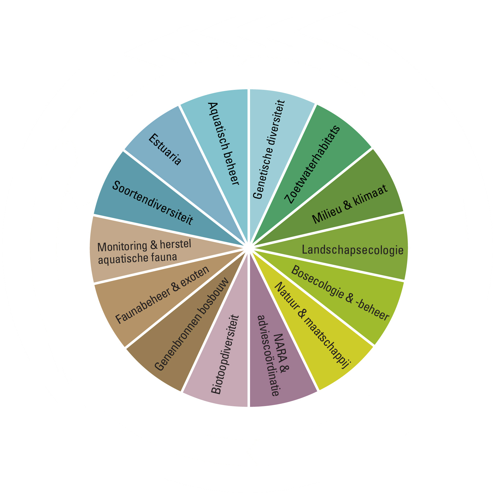
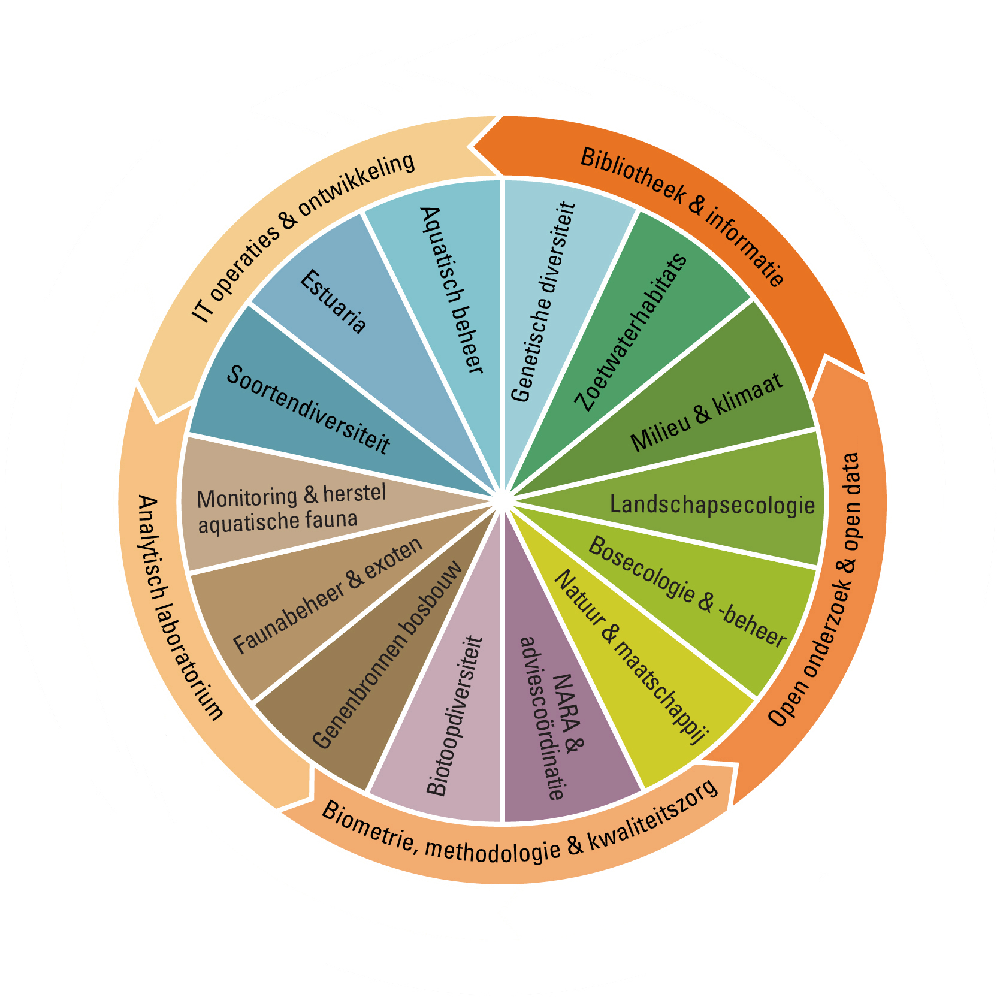
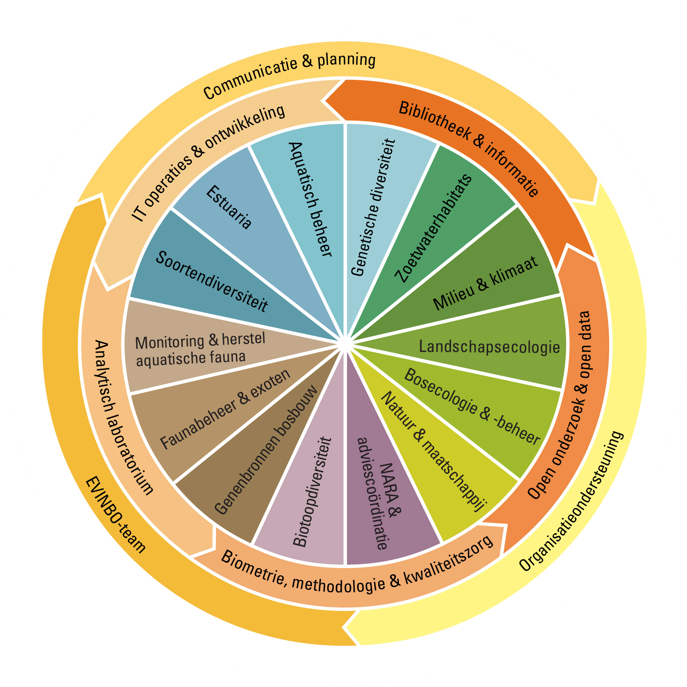
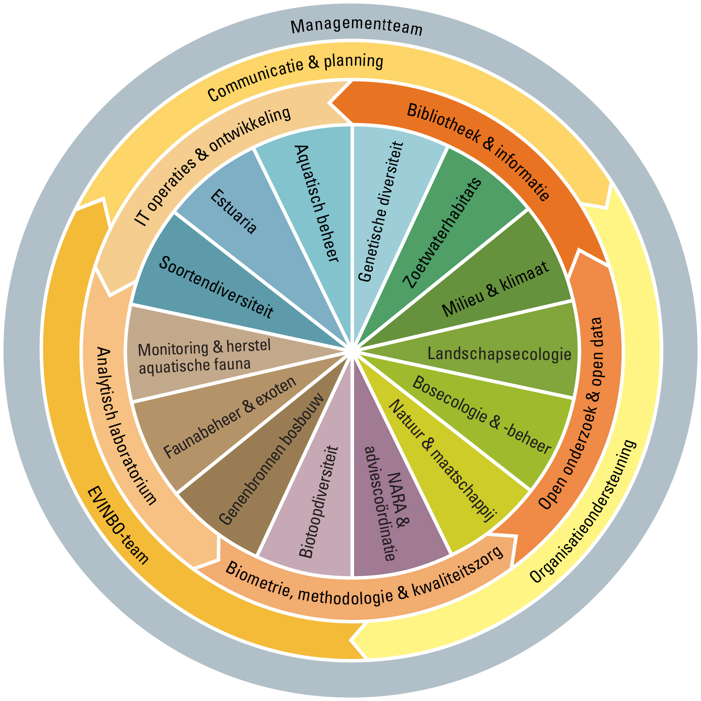

```{r setup, include = FALSE}
library(knitr)
opts_chunk$set(
  echo = FALSE,
  cache = TRUE,
  autodep = TRUE
)
library(rhinolophus)
library(raster)
library(dplyr)
library(ggplot2)
library(INBOtheme)
library(plotly)
```

# Introduction

## Talk outline

- intro
- INBO
- BMK
- bats & classification problem

## Goals of the talk

- main goal: feedback on classification of bat calls
- introducting INBO and BMK
- looking for potential collaboration

## Thierry Onkelinx

- degrees [](https://orcid.org/0000-0001-8804-4216)
    - MSc forestry
    - MSc statistical data analysis
- interests
    - design and analysis of longterm monitoring
    - mixed models
    - reproducible and traceable research
    - spatial data
    - bats
    - blog: https://www.muscardinus.be/

# INBO

---

<iframe src="https://player.vimeo.com/video/42329947" width="640" height="512" frameborder="0" webkitallowfullscreen mozallowfullscreen allowfullscreen></iframe>

## Organigram



## Organigram



## Organigram



## Organigram



## Staff

```{r staff}
staff <- 265
admin <- 6 + 13 + 2
management <- 8
wo <- c(BMK = 8, Data = 6, ICT = 5, Lifewatch = 6, Lab = 10, Bib = 8)
science <- staff - admin - sum(wo) - management
```

- `r staff` staff
    - `r science` scientific staff (scientists + technicians)
    - `r sum(wo)` support for scientific staff
    - `r admin` administrative staff
    - `r management` management
- 6 specialised teams dedicated to support the scientific staff
    1. Biometry, Methodology & Quality assurance (`r wo["BMK"]`)
    1. Datamanagement (`r wo["Data"]`)
    1. Lifewatch (`r wo["Lifewatch"]`)
    1. IT operations & development  (`r wo["ICT"]`)
    1. Laboratory  (`r wo["Lab"]`)
    1. Library  (`r wo["Bib"]`)

# Bats

## Overview

- 1000+ species (21 in Belgium)
- all species protected by EU and national legislation
    - need to report status and trend to EU
- noctural lifestyle
    - hides during the day
    - visual assesment during night not feasible
    - listen to echolocation

---

```{r}
include_graphics("echoa.gif")
```

---

<iframe width="560" height="315" src="https://www.youtube-nocookie.com/embed/MgRh_Q_xwys" frameborder="0" allowfullscreen></iframe>

## Echolocation analysis

- ultrasonic
- record sound with high sampling rate (> 310 kHz)
- convert sound to sonogram
- interpretation of sonogram

---

```{r}
include_graphics("species_pulse.png")
```

---

```{r}
night <- readRDS("night.rds")
p <- ggplot(data = night, aes(x = mtime)) + 
  geom_histogram(binwidth = 5 * 60) +
  geom_density(adjust = 0.5, aes(y = 5 * 60 * ..count..), colour = inbo.hoofd) +
  scale_x_datetime("Time of night") +
  scale_y_continuous("Number of recordings per 5 min") +
  ggtitle("One night at 'kasteel van Beersel'")
ggplotly(p, dynamicTicks = TRUE)
```

## Monitoring bats

- $n_d \ge 20$ sites / routes
- $n_n \ge 5$ nights
- $n_r \sim 500$ recordings per night and per site
- $n_s \ge 6$ species
- $n_y \ge 24$ years

A minimal setup

  - $n_d n_n n_r n_s \ge 300k$ recordings/year
  - $\frac{300k \times 0.1min}{60 min/h \times 8h/d \times 200d/y} = 0.31 FTE$

## Goals for automatic classification

- ideally: number of individuals per species
- more realistic
    1. "bats" vs "no bats"
    1. split in large groups
    1. discrimitate most species
    1. semi-supervised learning

# Things get complicated

## Other sources of ultrasound

- crickets
- raindrops
- wind through foliage
- observer
- cars: engine, breaking, indicators, ...

## Bats are not birds 

@Russo2017

- social communication
    - reciever listens to direct sound
    - information = content of the sound
- echolocation
    - reciever listens to reflected sound
    - information = deformation of emitted sound

## Habitat structure

```{r}
include_graphics("open-close.png")
```

## Phylogenetic dependencies

```{r}
include_graphics("pipistrelle.png")
```

## Call type

```{r}
include_graphics("call-type.png")
```

---

```{r}
v <- 343
v_r <- seq(0, 20, by = 2)
v_s <- seq(0, 15)
f_s <- c(20, 45, 90)
p <- expand.grid(
  v = v,
  v_r = v_r,
  v_s = v_s,
  f_s = f_s,
  d_s = c(-1, 1),
  d_r = c(-1, 1)
) %>%
  mutate(
    f_c = f_s * (v + d_s * v_s) / (v + d_r * v_r) - f_s,
    direction = ifelse(
      d_s == 1,
      ifelse(d_r == 1, "forward", "opposite"),
      ifelse(d_r == 1, "towards", "backward")
    ) %>%
      factor(),
    f_s = factor(f_s, labels = paste0(unique(f_s), "kHz"))
  ) %>%
  ggplot(aes(x = v_s, y = f_c, colour = f_s, group = direction, frame = v_r)) +
  geom_line() +
  xlab("Speed of the bat (m/s)") + 
  scale_y_continuous("Change in frequency (kHz)", breaks = seq(-10, 10, by = 2)) +
  ggtitle("Doppler shift")
ggplotly(p, dynamicTicks = TRUE)
```

## Atmospheric attenuation

- sounds are absorbed by air
- key factors: distance and frequency
- result: partial calls

## Real sonogram

```{r read_sonogram}
filename <- "mdau-1_nnoc-1_ppip-2µl1µA048_AHP.WAV"
sonogram <- read_wav(
  filename,
  channel = gsub(".*µ(.)([[:digit:]])*µ.*", "\\1", filename),
  te.factor = as.integer(gsub(".*µ(.)([[:digit:]])*µ.*", "\\2", filename))
) %>%
  wav2spectrogram()
sonogram@SpecGram$f <- sonogram@SpecGram$f / 1000
sonogram@SpecGram$t <- sonogram@SpecGram$t * 1000
sonor <- raster(
  sonogram@SpecGram$S[rev(seq_along(sonogram@SpecGram$f)), ],
  xmn = min(sonogram@SpecGram$t),
  xmx = max(sonogram@SpecGram$t),
  ymn = min(sonogram@SpecGram$f),
  ymx = max(sonogram@SpecGram$f)
)
```

```{r sonogram, cache = FALSE}
sonor2 <- sonor
sonor2[sonor2 < 0] <- NA
breaks <- pretty(0:cellStats(sonor2, max), 20)
plot(
  sonor2, 
  breaks = breaks, 
  col = rev(rainbow(length(breaks), end = 0.7)),
  colNA = "black",
  xlim = c(0, 200),
  ylim = c(0, 140),
  xlab = "time (ms)",
  ylab = "frequency (kHz)"
)
```

# Things I've tried & idea's

## Extract pulses from sonogram

```{r pulse}
dB <- extent(1618, 1628, 40, 110) %>%
  crop(x = sonor)
dBm <- as.matrix(dB)
dBm <- dBm[, rev(seq_len(ncol(dBm)))]
plot_ly(z = ~dBm, type = "surface")
```

## Convert pulses into numbers

- watershed: ridge or valley detection
- pixels or voxels
- elliptical Fourier on contours
- spherical Fourier on surface

## Elliptical Fourier

```{r elliptical-fourier, message = FALSE, warning = FALSE}
contour <- get_contours(dB, cellStats(dB, max) - 25)[2, ] %>%
  fortify() %>%
  mutate(theta = 2 * pi * order / (n() - 1))
fourier <- lapply(
  1:20,
  function(n){
    form <- sprintf("I(sin(%1$i * theta)) + I(cos(%1$i * theta))", seq_len(n)) %>%
      paste(collapse = "+") %>%
      sprintf(fmt = "cbind(long, lat) ~ %s") %>%
      as.formula()
    model <- lm(form, data = contour)
    fitted(model) %>%
      as.data.frame() %>%
      mutate(component = n)
  }
) %>%
  bind_rows()
p <- ggplot(contour, aes(x = long, y = lat)) +
  geom_polygon(fill = NA, colour = inbo.hoofd) +
  geom_polygon(
    data = fourier, 
    aes(frame = component), 
    fill = NA
  ) +
  coord_fixed() +
  xlab("time (ms)") +
  ylab("frequency (kHz)")
ggplotly(p)
```

## Unsupervised classification

- self organizing maps

$\left \lfloor{\log(n)}\right \rfloor$


## Manual interpretation of stratified sample


## Semi-supervised classification

- long short-term memory network within recording
- long short-term memory network among recordings

## References
